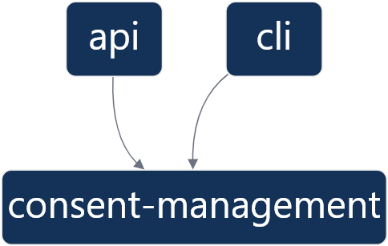

# Consent management coding test

## Requirements

NodeJS 16+ and Docker to run Mongodb if none available

## Setup

Install dependencies
> npm ci

Run tests
> npm run test

Start docker Mongodb
> npm run db

## Architecture

To have an overview of applications and libraries dependencies run `npm run graph`

Application `API` exposes http rest endpoints as well as swagger documentation.
Application `CLI` exposes command line interface.

Library `consent-management` exposes domain, repositories and mongodb implementatioh. An area of improvement would be to create a library dedicated to MongoDb repositories. This is out of the current scope.

### Dependency graph

## Specifications

Api specification as defined in coding exercice is located in [`apps\api\README.md`](apps/api/README.md)
